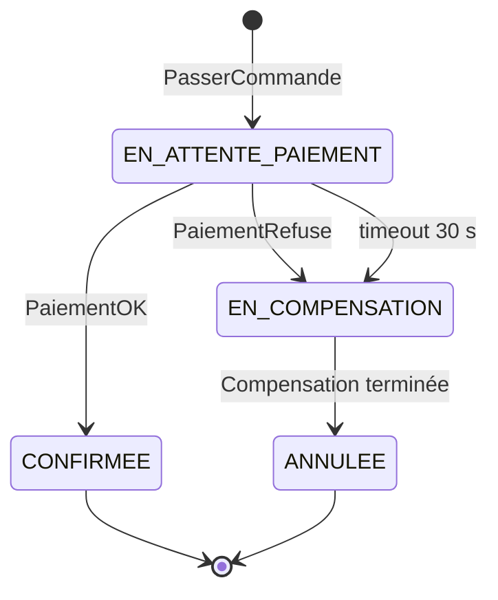

# Saga FoodFlow — proposition d'une version **orchestrée**

> ⚠️ Ce document est fourni à des fins de **comparaison**. Dans l'implémentation actuelle de FoodFlow, la saga repose sur une approche **chorégraphiée** (voir `adr/1-choregraphie-vs-orchestration.md`). L'objectif de ce document est de montrer comment cette même saga pourrait être réalisée avec un **orchestrateur central**, afin de comparer les deux architectures.

## Rappel : fonctionnement actuel (chorégraphie)

Dans l'architecture actuelle, **aucun composant ne coordonne directement la saga**. Chaque microservice consomme les événements qui le concernent puis publie de nouveaux événements. Le déroulement complet de la saga résulte donc des interactions entre les différents services.

```text
POST /orders
  order-service   --OrderCreated-->        orders.events
  payment-service (consomme)           --PaymentAuthorized|PaymentRefused--> payments.events
  order-service   (consomme) -> CONFIRMED | CANCELLED
                  et, en cas d'échec : --OrderCancelled--> orders.events
```

L'avancement de la saga est représenté uniquement par le champ `status` de la commande (`CREATED`, `CONFIRMED` ou `CANCELLED`). Aucun service ne possède une vision complète du processus.

---

## Version orchestrée : un coordinateur central

Dans une architecture orchestrée, un composant dédié (intégré à `order-service` ou déployé comme un service `saga-orchestrator`) devient responsable du pilotage de la saga.

Ses principales responsabilités sont :

- envoyer des **commandes** aux services concernés ;
- attendre les événements de retour ;
- faire évoluer la saga en suivant une **machine à états**.

### 1. Machine à états



| État | Description | Transition |
|------|-------------|------------|
| **EN_ATTENTE_PAIEMENT** | La commande est créée et une demande de paiement a été envoyée. | Paiement accepté → **CONFIRMEE** ; paiement refusé ou absence de réponse après 30 s → **EN_COMPENSATION** |
| **CONFIRMEE** | Le paiement a été validé et la saga est terminée avec succès. | État final |
| **EN_COMPENSATION** | Une procédure de compensation est lancée afin d'annuler les actions déjà réalisées. | Compensation terminée → **ANNULEE** |
| **ANNULEE** | La saga se termine par un échec et la commande est annulée. | État final |

L'un des principaux intérêts de cette approche est la **gestion des délais d'attente**. Dès l'entrée dans l'état `EN_ATTENTE_PAIEMENT`, l'orchestrateur démarre un timer de 30 secondes. Si aucun événement `PaymentAuthorized` ou `PaymentRefused` n'est reçu avant ce délai, il considère que le paiement a échoué et déclenche automatiquement la compensation. Dans la version chorégraphiée actuelle, aucune surveillance de ce type n'est prévue.

### 2. Introduction des commandes

Contrairement à la chorégraphie, l'orchestration distingue clairement les **commandes** des **événements**.

| Type | Exemple | Signification | Topic |
|------|---------|---------------|-------|
| **Commande** | `AutoriserPaiement` | Demande envoyée à un service pour qu'il réalise une action. | `payment.commands` |
| **Événement** | `PaymentAuthorized` | Information indiquant qu'une action a déjà été effectuée. | `payments.events` |

Une **commande** représente une action à exécuter et est destinée à un service précis. Ce dernier peut accepter ou refuser son exécution.

À l'inverse, un **événement** décrit un fait déjà réalisé. Il est publié afin que les autres services puissent en être informés.

Dans ce scénario, l'orchestrateur envoie la commande `AutoriserPaiement` sur le topic `payment.commands`. Le `payment-service` traite cette commande puis publie soit `PaymentAuthorized`, soit `PaymentRefused` sur `payments.events`. L'orchestrateur consomme ensuite cet événement pour poursuivre la saga.

À terme, d'autres commandes pourraient être ajoutées, comme `RembourserPaiement`, afin de gérer des compensations plus complexes.

### 3. Stockage de l'état de la saga

Deux solutions peuvent être envisagées.

#### Option 1 : une table `saga_state` dans `order-service`

Chaque saga est enregistrée dans une table contenant notamment :

- `sagaId`
- `orderId`
- état courant
- `deadline`
- `updatedAt`

Cette solution est simple à mettre en place puisqu'elle ne nécessite pas de nouveau microservice. En revanche, elle mélange la logique métier des commandes avec celle de l'orchestration.

#### Option 2 : un service dédié

Une autre possibilité consiste à créer un microservice `saga-orchestrator` disposant de sa propre base de données.

Cette architecture sépare clairement les responsabilités mais ajoute un composant supplémentaire qu'il faudra développer, déployer, surveiller et maintenir.

Dans le cas de FoodFlow, qui ne comporte actuellement que deux étapes principales, conserver l'état de la saga dans `order-service` reste probablement le choix le plus adapté.

### 4. Les avantages

L'orchestration offre plusieurs bénéfices :

- gestion automatique des **timeouts**, permettant de détecter les services qui ne répondent plus ;
- meilleure visibilité sur l'avancement de chaque saga grâce à une machine à états centralisée ;
- débogage simplifié, car il est possible de connaître rapidement l'état courant d'une saga sans analyser les journaux de plusieurs services.

### 5. Les limites

Cette approche présente également quelques inconvénients :

- les services deviennent dépendants de l'orchestrateur, ce qui augmente le couplage ;
- l'orchestrateur constitue un point central dont la panne peut empêcher la progression des sagas ;
- un développement supplémentaire est nécessaire pour gérer la machine à états, la persistance, les timeouts et la reprise après incident.

---

## Conclusion

Pour **FoodFlow**, dont la saga actuelle ne comporte que deux étapes principales (commande puis paiement), l'approche **chorégraphiée** reste la solution la plus adaptée. Elle est plus simple à maintenir, réduit le couplage entre les microservices et nécessite moins d'infrastructure.

En revanche, si le processus métier évoluait vers un enchaînement plus long (préparation, expédition, livraison, remboursement, etc.), une orchestration centralisée deviendrait plus pertinente grâce à sa meilleure visibilité, à la gestion des délais d'attente et à la coordination simplifiée des différentes étapes. Les raisons de ce choix sont détaillées dans l'ADR `1-choregraphie-vs-orchestration.md`.